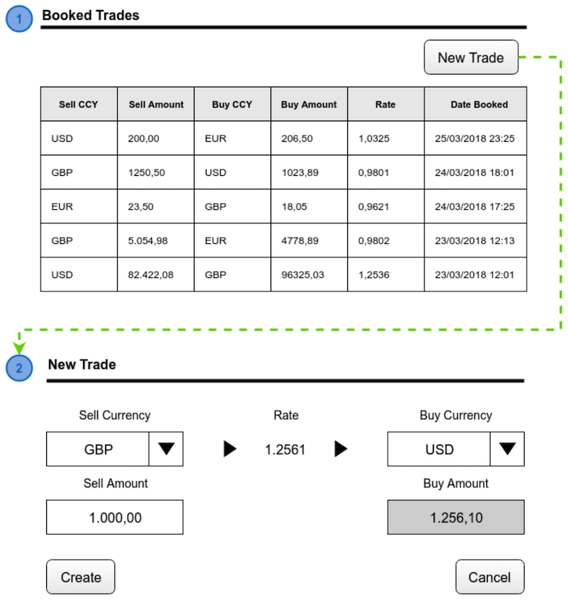

# Requirements definition

We want to build a new web application that will allow us to create and store foreign exchange trades.

The main view is the Ebury Trading application, which contains a Trade list view, displaying the list of already booked trades and the relevant fields, Sell Currency, Sell Amount, Buy Currency, Buy Amount and Rate.

**REQ1** - A view to create new trades, as shown in Figure 2 of the wireframe, should be accessed by the “New Trade”.
The initial value of both the “Sell Currency” & “Buy Currency” dropdowns should be empty, and when the user selects a value in both of them, the frontend app should retrieve the latest rate for the selected currency pair and display it. See REQ3 to know more about where rates are coming from.
The “Buy Amount” should not be editable and instead be automatically calculated by multiplying the “Sell Amount” by the rate. The "Rate" should not be editable either.

For this requirement please fill NewTradeController Apex class and the newTrade LWC.


**REQ2** - Send a notification after trade creation notifying all users in a queue named ‘Trade reviewers’. Content:

“A new trade has been created with the following data: <br>
Sell Currency: {sell ccy} <br>
Sell Amount: {sell amount} <br>
Buy Currency: {buy ccy} <br>
Buy Amount: {buy amount} <br>
Rate: {rate} <br>
Booked Date: {date} <br>
Link to the trade: {trade link}"

For this requirement please extend REQ 1.

**REQ3** - As we don’t have a direct connection with a central rate provider, we will need to use an external service that can give us this information through an API. We have selected fixer.io for this. The application will connect to fixer.io to bring the latest currency rates available.

For this requirement please extend REQ 1.

**REQ4** - Tests classes covering REQ 1, 2 and 3.

**REQ5** - This application will be deployed using Salesforce CLI and Salesforce DX. Please, update the build.sh script to create the scratch org if needed and leave it ready for testing.



## Constraints and Suggestions

* Test coverage, comments, clean code, design patterns, separation of concerns and the use of standardized style guides will be highly appreciated.
* A detailed Git history will be appreciated.
* VFPs and Aura are not allowed, please use only LWC.

Once you have finished, please create a git bundle to send back to us with this command:
```
$ git bundle create repo.bundle --all
```

# GOOD LUCK!
